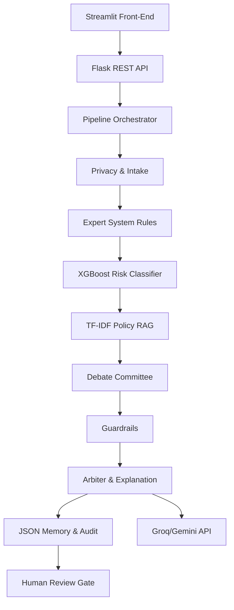

# AuthGuard AI System Architecture

## Overview
AuthGuard AI is a comprehensive, human-governed prior-authorization decision-support command center. It leverages a multi-agent architecture combined with deterministic expert rules, an XGBoost risk classifier, Local Policy RAG, and an integrated debate committee. The entire platform consists of a **Streamlit front-end** that acts as the command center and a **Flask backend API** that processes the inference pipelines.

The platform is designed to be highly observable and heavily governed, ensuring that all actions can be audited, while humans remain in the loop for anything demanding critical attention (such as high denial risk, urgent requests, or blocked evidence).

---

## High-Level Architecture Components

The application is vertically integrated with a modular structure combining UI and an orchestrator backend.

### 1. Front-End: Streamlit Dashboard (`frontend/dashboard.py`)
- Provides a "dark-mode" operations-center interface.
- Responsive UI containing an intake form, pipeline visualization (status lights, radar animation), and a debate summary matrix.
- Separated tabs for decision overview, clinical evidence, RAG policies, raw JSON results, and similar cases (memory).
- Communicates directly with the backend via the Flask API or orchestrated Python modules locally.

### 2. Back-End: Flask REST API (`backend/server.py` & `app.py`)
- **Web Framework:** Flask wrapped in Waitress for production readiness.
- **Role:** Handles programmatic processing of cases (`/api/process`), serving the results of the multi-agent pipeline to the Streamlit UI or external callers.
- **Port Structure:** Flask API runs on `AUTHGUARD_API_PORT` (default `5008`), while Streamlit runs on `PORT` (default `8501`). Waitress serves the Flask app via a background daemon thread in `app.py`.

### 3. Deployment Configuration (Heroku/Railway)
- **Procfile:** Contains `web: python app.py` which concurrently spins up the Flask Waitress server and Streamlit UI.
- **runtime.txt:** Defines the specific Python version required for the container.
- **Dependencies:** Specified in `requirements.txt`.
- **Environment Management:** Uses `.env` for secrets (Groq/Gemini API keys, Live Data URLs).

---

## Multi-Agent Decision Pipeline

AuthGuard's orchestration leverages several specialized "agents" (modules) to form a complete prior-authorization analysis.

### 1. Privacy Shield & Intake
- Validates the case and redacts Personally Identifiable Information (PII) like SSNs, emails, and phones.
- Detects prompt-injections to ensure security before processing via LLMs.

### 2. Eligibility & Deterministic Expert System (`backend/expert_system.py`)
- Checks standard coverage logic and minimum clinical documentation thresholds using predefined rules.
- Fast and reliable rule-based assertions that bypass LLM hallucination risks.

### 3. Policy RAG Agent (`backend/rag.py`)
- **Algorithm:** Uses TF-IDF based similarity retrieval.
- **Function:** Reads local text documents from `data/knowledge/` and chunks them to provide context.
- Searches for relevant payer guidance, documentation checklists, and appeal rules based on the case diagnosis, service type, and urgency.

### 4. XGBoost Denial-Risk Agent (`backend/model.py`)
- Utilizes a pre-trained XGBoost classifier to compute the probability of a claim denial.
- Outputs a risk band (e.g., Critical, High, Low) and feature contributions (top risk drivers like missing documentation or lack of conservative therapy).

### 5. Multi-Agent Debate Committee (`backend/agents/committee.py`)
- Aggregates the findings of various virtual agents (Coverage, Clinical Evidence, Policy RAG, Risk Model, Devil's Advocate, and Compliance).
- Each agent votes with:
  - **Stance:** `SUPPORT`, `OPPOSE`, or `CAUTION`
  - **Confidence Score**
  - **Evidence List**
  - **Recommended Next Action**
- Ensures diverse analytical perspectives rather than a single black-box output.

### 6. Guardrail Sentinel (`backend/guardrails.py`)
- Acts as a deterministic lock that prevents unsafe actions.
- Enforces human review under strict conditions (e.g., missing mandatory evidence, critical denial risk, urgency, or prompt-injection detection).
- Guardrails can only make a route *stricter*, never more permissive.

### 7. Arbiter Agent & External Explanations (`backend/llm_clients.py`)
- Responsible for synthesizing the debate committee's findings.
- **External Providers:** Can invoke **Groq** (e.g., Llama 3) or **Google Gemini** to generate human-readable narratives summarizing the pipeline logic.
- External models are strictly "explanation-only" and are walled off from altering the final Guardrail routing decision. If API keys are missing or offline, the system safely falls back to a deterministic explanation.

---

## Data Management & Memory

AuthGuard maintains several persistence points in the `database/` directory via JSON structures (designed to be replaceable by scalable transactional databases in production).

- `database/cases.json`: Stores full structured pipeline results.
- `database/memory_history.json`: Compact case summaries used to retrieve "similar past cases" for the UI.
- `database/audit_log.json`: The human-review actions and rationale logging.
- `database/memory_state.json`: Trackers and counters for processed and reviewed cases.

---

## Security & Trust Boundary

1. **Immutable Routing:** The decision route is firmly established by the deterministic Expert Rules and Guardrails.
2. **LLM Isolation:** The LLM does not have agency over the decision. It is purely utilized for explanation generation.
3. **Prompt Injection Safety:** The Privacy Shield detects adversarial prompts and bypasses the LLM phase completely, enforcing manual review.
4. **Mandatory Human-In-The-Loop:** The system forces a reviewer to interact (`APPROVE_PACKAGE_FOR_SUBMISSION`, `REQUEST_ADDITIONAL_EVIDENCE`, `REJECT_OR_REROUTE`) before a case is finalized.

---

## Infrastructure summary

